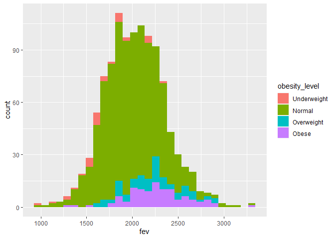

Assignment2
================

``` r
library(data.table)
library(tidyverse)
```

    ## -- Attaching packages --------------------------------------------------------------------- tidyverse 1.3.0 --

    ## √ ggplot2 3.3.2     √ purrr   0.3.4
    ## √ tibble  3.0.3     √ dplyr   1.0.2
    ## √ tidyr   1.1.1     √ stringr 1.4.0
    ## √ readr   1.3.1     √ forcats 0.5.0

    ## -- Conflicts ------------------------------------------------------------------------ tidyverse_conflicts() --
    ## x dplyr::between()   masks data.table::between()
    ## x dplyr::filter()    masks stats::filter()
    ## x dplyr::first()     masks data.table::first()
    ## x dplyr::lag()       masks stats::lag()
    ## x dplyr::last()      masks data.table::last()
    ## x purrr::transpose() masks data.table::transpose()

``` r
library(ggplot2)
library(readr)
library(dplyr)
library(dtplyr)
library(Hmisc)
```

    ## Loading required package: lattice

    ## Loading required package: survival

    ## Loading required package: Formula

    ## 
    ## Attaching package: 'Hmisc'

    ## The following objects are masked from 'package:dplyr':
    ## 
    ##     src, summarize

    ## The following objects are masked from 'package:base':
    ## 
    ##     format.pval, units

``` r
library(leaflet)
library(ggfortify)
```

``` r
urlfile=("https://raw.githubusercontent.com/USCbiostats/data-science-data/master/01_chs/chs_individual.csv")
chs_individual<-read_csv(url(urlfile))
```

    ## Parsed with column specification:
    ## cols(
    ##   .default = col_double(),
    ##   townname = col_character(),
    ##   race = col_character()
    ## )

    ## See spec(...) for full column specifications.

``` r
urlfile=("https://raw.githubusercontent.com/USCbiostats/data-science-data/master/01_chs/chs_regional.csv")
chs_regional<-read_csv(url(urlfile))
```

    ## Parsed with column specification:
    ## cols(
    ##   .default = col_double(),
    ##   townname = col_character()
    ## )
    ## See spec(...) for full column specifications.

``` r
head(chs_individual)
```

    ## # A tibble: 6 x 23
    ##     sid townname  male race  hispanic agepft height weight   bmi asthma
    ##   <dbl> <chr>    <dbl> <chr>    <dbl>  <dbl>  <dbl>  <dbl> <dbl>  <dbl>
    ## 1     1 Lancast~     1 W            0  10.2     123     54  16.2      0
    ## 2     2 Lancast~     1 W            0  10.5     145     77  16.6      0
    ## 3     6 Lancast~     0 B            0  10.1     145    143  30.9      0
    ## 4     7 Lancast~     0 O            0  10.7     156     72  13.4      0
    ## 5     8 Lancast~     0 W            1   9.78    132     61  15.9      0
    ## 6    10 Lancast~     1 O            1  NA        NA     NA  NA        0
    ## # ... with 13 more variables: active_asthma <dbl>, father_asthma <dbl>,
    ## #   mother_asthma <dbl>, wheeze <dbl>, hayfever <dbl>, allergy <dbl>,
    ## #   educ_parent <dbl>, smoke <dbl>, pets <dbl>, gasstove <dbl>, fev <dbl>,
    ## #   fvc <dbl>, mmef <dbl>

``` r
head(chs_regional)
```

    ## # A tibble: 6 x 27
    ##   townname pm25_mass pm25_so4 pm25_no3 pm25_nh4 pm25_oc pm25_ec pm25_om pm10_oc
    ##   <chr>        <dbl>    <dbl>    <dbl>    <dbl>   <dbl>   <dbl>   <dbl>   <dbl>
    ## 1 Alpine        8.74     1.73     1.59     0.88    2.54    0.48    3.04    3.25
    ## 2 Lake El~     12.4      1.9      2.98     1.36    3.64    0.62    4.36    4.66
    ## 3 Lake Gr~      7.66     1.07     2.07     0.91    2.46    0.4     2.96    3.16
    ## 4 Lancast~      8.5      0.91     1.87     0.78    4.43    0.55    5.32    5.68
    ## 5 Lompoc        5.96     1.08     0.73     0.41    1.45    0.13    1.74    1.86
    ## 6 Long Be~     19.1      3.23     6.22     2.57    5.21    1.36    6.25    6.68
    ## # ... with 18 more variables: pm10_ec <dbl>, pm10_tc <dbl>, formic <dbl>,
    ## #   acetic <dbl>, hcl <dbl>, hno3 <dbl>, o3_max <dbl>, o3106 <dbl>,
    ## #   o3_24 <dbl>, no2 <dbl>, pm10 <dbl>, no_24hr <dbl>, pm2_5_fr <dbl>,
    ## #   iacid <dbl>, oacid <dbl>, total_acids <dbl>, lon <dbl>, lat <dbl>

\#Data Wrangling

1.  
<!-- end list -->

``` r
chs_merged <- 
  chs_individual %>%
  left_join(chs_regional, by="townname")

dim(chs_individual)
```

    ## [1] 1200   23

``` r
dim(chs_regional)
```

    ## [1] 12 27

``` r
dim(chs_merged)
```

    ## [1] 1200   49

``` r
head(chs_merged)
```

    ## # A tibble: 6 x 49
    ##     sid townname  male race  hispanic agepft height weight   bmi asthma
    ##   <dbl> <chr>    <dbl> <chr>    <dbl>  <dbl>  <dbl>  <dbl> <dbl>  <dbl>
    ## 1     1 Lancast~     1 W            0  10.2     123     54  16.2      0
    ## 2     2 Lancast~     1 W            0  10.5     145     77  16.6      0
    ## 3     6 Lancast~     0 B            0  10.1     145    143  30.9      0
    ## 4     7 Lancast~     0 O            0  10.7     156     72  13.4      0
    ## 5     8 Lancast~     0 W            1   9.78    132     61  15.9      0
    ## 6    10 Lancast~     1 O            1  NA        NA     NA  NA        0
    ## # ... with 39 more variables: active_asthma <dbl>, father_asthma <dbl>,
    ## #   mother_asthma <dbl>, wheeze <dbl>, hayfever <dbl>, allergy <dbl>,
    ## #   educ_parent <dbl>, smoke <dbl>, pets <dbl>, gasstove <dbl>, fev <dbl>,
    ## #   fvc <dbl>, mmef <dbl>, pm25_mass <dbl>, pm25_so4 <dbl>, pm25_no3 <dbl>,
    ## #   pm25_nh4 <dbl>, pm25_oc <dbl>, pm25_ec <dbl>, pm25_om <dbl>, pm10_oc <dbl>,
    ## #   pm10_ec <dbl>, pm10_tc <dbl>, formic <dbl>, acetic <dbl>, hcl <dbl>,
    ## #   hno3 <dbl>, o3_max <dbl>, o3106 <dbl>, o3_24 <dbl>, no2 <dbl>, pm10 <dbl>,
    ## #   no_24hr <dbl>, pm2_5_fr <dbl>, iacid <dbl>, oacid <dbl>, total_acids <dbl>,
    ## #   lon <dbl>, lat <dbl>

2.  
<!-- end list -->

``` r
chs_merged <-
  chs_merged %>%
  mutate(
    obesity_level = cut(
      bmi,
      breaks = c(0, 14, 22, 24, 100),
      right = F,
      labels = c("Underweight", "Normal", "Overweight", "Obese"),
      ))

chs_merged %>%
  select(obesity_level, bmi)
```

    ## # A tibble: 1,200 x 2
    ##    obesity_level   bmi
    ##    <fct>         <dbl>
    ##  1 Normal         16.2
    ##  2 Normal         16.6
    ##  3 Obese          30.9
    ##  4 Underweight    13.4
    ##  5 Normal         15.9
    ##  6 <NA>           NA  
    ##  7 Normal         18.3
    ##  8 Normal         16.9
    ##  9 <NA>           NA  
    ## 10 Normal         16.9
    ## # ... with 1,190 more rows

``` r
chs_merged %>% 
  group_by(obesity_level) %>% summarise(max(bmi), min(bmi))
```

    ## `summarise()` ungrouping output (override with `.groups` argument)

    ## # A tibble: 5 x 3
    ##   obesity_level `max(bmi)` `min(bmi)`
    ##   <fct>              <dbl>      <dbl>
    ## 1 Underweight         14.0       11.3
    ## 2 Normal              22.0       14.0
    ## 3 Overweight          24.0       22.0
    ## 4 Obese               41.3       24.0
    ## 5 <NA>                NA         NA

3.  
<!-- end list -->

``` r
chs_merged <-
  chs_merged %>%
  mutate(
    smoke_gas_exposure = case_when(smoke==0 & gasstove==0 ~ "None of both",
                                   smoke==1 & gasstove==0 ~ "Smoke only", 
                                   smoke==0 & gasstove==1 ~ "Gas stove only",
                                   smoke==1 & gasstove==1 ~ "Both"
                                         ))
                                
table(chs_merged$smoke_gas_exposure)
```

    ## 
    ##           Both Gas stove only   None of both     Smoke only 
    ##            151            739            214             36

4.  
<!-- end list -->

``` r
chs_merged %>% 
  group_by(townname) %>% summarise(mean(fev, na.rm=TRUE), sd(fev, na.rm = TRUE), mean(asthma, na.rm = TRUE), sd(asthma, na.rm = TRUE))
```

    ## `summarise()` ungrouping output (override with `.groups` argument)

    ## # A tibble: 12 x 5
    ##    townname  `mean(fev, na.r~ `sd(fev, na.rm ~ `mean(asthma, n~ `sd(asthma, na.~
    ##    <chr>                <dbl>            <dbl>            <dbl>            <dbl>
    ##  1 Alpine               2089.             298.            0.113            0.319
    ##  2 Atascade~            2079.             332.            0.255            0.438
    ##  3 Lake Els~            2040.             318.            0.126            0.334
    ##  4 Lake Gre~            2092.             338.            0.152            0.360
    ##  5 Lancaster            2003.             337.            0.165            0.373
    ##  6 Lompoc               2038.             367.            0.113            0.319
    ##  7 Long Bea~            1984.             331.            0.135            0.344
    ##  8 Mira Loma            1985.             337.            0.158            0.367
    ##  9 Riverside            1986.             290.            0.11             0.314
    ## 10 San Dimas            2028.             322.            0.172            0.379
    ## 11 Santa Ma~            2023.             330.            0.134            0.342
    ## 12 Upland               2027.             357.            0.121            0.328

``` r
chs_merged %>% 
  group_by(male) %>% summarise(mean(fev, na.rm=TRUE), sd(fev, na.rm = TRUE), mean(asthma, na.rm = TRUE), sd(asthma, na.rm = TRUE))
```

    ## `summarise()` ungrouping output (override with `.groups` argument)

    ## # A tibble: 2 x 5
    ##    male `mean(fev, na.rm ~ `sd(fev, na.rm =~ `mean(asthma, na~ `sd(asthma, na.r~
    ##   <dbl>              <dbl>             <dbl>             <dbl>             <dbl>
    ## 1     0              1959.              327.             0.121             0.326
    ## 2     1              2104.              318.             0.173             0.378

``` r
chs_merged %>% 
  group_by(obesity_level) %>% summarise(mean(fev, na.rm=TRUE), sd(fev, na.rm = TRUE), mean(asthma, na.rm = TRUE), sd(asthma, na.rm = TRUE))
```

    ## `summarise()` ungrouping output (override with `.groups` argument)

    ## # A tibble: 5 x 5
    ##   obesity_level `mean(fev, na.r~ `sd(fev, na.rm ~ `mean(asthma, n~
    ##   <fct>                    <dbl>            <dbl>            <dbl>
    ## 1 Underweight              1687.             300.           0.0857
    ## 2 Normal                   1998.             309.           0.141 
    ## 3 Overweight               2224.             317.           0.165 
    ## 4 Obese                    2269.             326.           0.21  
    ## 5 <NA>                      NaN               NA            0.131 
    ## # ... with 1 more variable: `sd(asthma, na.rm = TRUE)` <dbl>

``` r
chs_merged %>% 
  group_by(smoke_gas_exposure) %>% summarise(mean(fev, na.rm=TRUE), sd(fev, na.rm = TRUE), mean(asthma, na.rm = TRUE), sd(asthma, na.rm = TRUE))
```

    ## `summarise()` ungrouping output (override with `.groups` argument)

    ## # A tibble: 5 x 5
    ##   smoke_gas_expos~ `mean(fev, na.r~ `sd(fev, na.rm ~ `mean(asthma, n~
    ##   <chr>                       <dbl>            <dbl>            <dbl>
    ## 1 Both                        2020.             313.            0.130
    ## 2 Gas stove only              2026.             328.            0.148
    ## 3 None of both                2060.             343.            0.148
    ## 4 Smoke only                  2064.             333.            0.171
    ## 5 <NA>                        2000.             365.            0.149
    ## # ... with 1 more variable: `sd(asthma, na.rm = TRUE)` <dbl>

\#Looking at the data (EDA) 1. - For each town, the regression line
shows that BMI and FEV has positive relationship.

``` r
chs_merged %>%
  filter(!(townname %in% NA)) %>%
ggplot(mapping = aes(y=bmi, x=fev, fill=townname))+
  geom_point()+
  geom_smooth(method = lm)+
  facet_wrap(~townname, nrow = 3)
```

    ## `geom_smooth()` using formula 'y ~ x'

    ## Warning: Removed 95 rows containing non-finite values (stat_smooth).

    ## Warning: Removed 95 rows containing missing values (geom_point).

<!-- -->

2.  
<!-- end list -->

  - For both histograms, significant relationship between variables were
    not detected.

<!-- end list -->

``` r
chs_merged %>%
  filter(!(obesity_level %in% NA)) %>%
ggplot(mapping = aes(x=fev, fill=obesity_level))+
  geom_histogram()
```

    ## `stat_bin()` using `bins = 30`. Pick better value with `binwidth`.

    ## Warning: Removed 6 rows containing non-finite values (stat_bin).

<!-- -->

``` r
chs_merged %>%
  ggplot(mapping = aes(x=fev, fill=smoke_gas_exposure))+
  geom_histogram()+
  scale_fill_viridis_d()
```

    ## `stat_bin()` using `bins = 30`. Pick better value with `binwidth`.

    ## Warning: Removed 95 rows containing non-finite values (stat_bin).

<!-- -->

3.  
<!-- end list -->

  - Does not show any relationship.

<!-- end list -->

``` r
chs_merged %>%
  ggplot(mapping = aes(x=obesity_level, fill=smoke_gas_exposure))+
  geom_bar()
```

<!-- -->

4.  
<!-- end list -->

  - The stat summary chart shows that there is a positive relationship
    between fev and bmi but not between fev and smoke\_gas\_exposure.

<!-- end list -->

``` r
chs_merged %>%
  ggplot()+
  stat_summary(mapping = aes(x=obesity_level, y=fev))
```

    ## Warning: Removed 95 rows containing non-finite values (stat_summary).

    ## No summary function supplied, defaulting to `mean_se()`

<!-- -->

``` r
chs_merged %>%
  ggplot()+
  stat_summary(mapping = aes(x=smoke_gas_exposure, y=fev))
```

    ## Warning: Removed 95 rows containing non-finite values (stat_summary).

    ## No summary function supplied, defaulting to `mean_se()`

<!-- -->

5.  
<!-- end list -->

  - The leaflet map shows that the red dots, which indicates higher
    pm2.5 mass, are concentrated in the metroplitan area.

<!-- end list -->

``` r
pm25_pal = colorNumeric(c('blue','red'), domain = chs_merged$pm25_mass)

leaflet(chs_merged) %>%
  addProviderTiles("OpenStreetMap") %>%
  addCircles(lng = ~lon, lat = ~lat, color=~pm25_pal(pm25_mass), opacity=1,fillOpacity=1, radius=500)
```

<!--html_preserve-->

<div id="htmlwidget-e9c79aa2426b1a5ef2c1" class="leaflet html-widget" style="width:672px;height:480px;">

</div>

<script type="application/json" data-for="htmlwidget-e9c79aa2426b1a5ef2c1">{"x":{"options":{"crs":{"crsClass":"L.CRS.EPSG3857","code":null,"proj4def":null,"projectedBounds":null,"options":{}}},"calls":[{"method":"addProviderTiles","args":["OpenStreetMap",null,null,{"errorTileUrl":"","noWrap":false,"detectRetina":false}]},{"method":"addCircles","args":[[34.6867846,34.6867846,34.6867846,34.6867846,34.6867846,34.6867846,34.6867846,34.6867846,34.6867846,34.6867846,34.6867846,34.6867846,34.6867846,34.6867846,34.6867846,34.6867846,34.6867846,34.6867846,34.6867846,34.6867846,34.6867846,34.6867846,34.6867846,34.6867846,34.6867846,34.6867846,34.6867846,34.6867846,34.6867846,34.6867846,34.6867846,34.6867846,34.6867846,34.6867846,34.6867846,34.6867846,34.6867846,34.6867846,34.6867846,34.6867846,34.6867846,34.6867846,34.6867846,34.6867846,34.6867846,34.6867846,34.6867846,34.6867846,34.6867846,34.6867846,34.6867846,34.6867846,34.6867846,34.6867846,34.6867846,34.6867846,34.6867846,34.6867846,34.6867846,34.6867846,34.6867846,34.6867846,34.6867846,34.6867846,34.6867846,34.6867846,34.6867846,34.6867846,34.6867846,34.6867846,34.6867846,34.6867846,34.6867846,34.6867846,34.6867846,34.6867846,34.6867846,34.6867846,34.6867846,34.6867846,34.6867846,34.6867846,34.6867846,34.6867846,34.6867846,34.6867846,34.6867846,34.6867846,34.6867846,34.6867846,34.1066756,34.1066756,34.1066756,34.1066756,34.1066756,34.1066756,34.1066756,34.1066756,34.1066756,34.1066756,34.1066756,34.1066756,34.1066756,34.1066756,34.1066756,34.1066756,34.1066756,34.1066756,34.1066756,34.1066756,34.1066756,34.1066756,34.6867846,34.6867846,34.6867846,34.6867846,34.6867846,34.6867846,34.6867846,34.6867846,34.6867846,34.6867846,34.1066756,34.1066756,34.1066756,34.1066756,34.1066756,34.1066756,34.1066756,34.1066756,34.1066756,34.1066756,34.1066756,34.1066756,34.1066756,34.1066756,34.1066756,34.1066756,34.1066756,34.1066756,34.1066756,34.1066756,34.1066756,34.1066756,34.1066756,34.1066756,34.1066756,34.1066756,34.1066756,34.1066756,34.1066756,34.1066756,34.1066756,34.1066756,34.1066756,34.1066756,34.1066756,34.1066756,34.1066756,34.1066756,34.1066756,34.1066756,34.1066756,34.1066756,34.1066756,34.1066756,34.1066756,34.1066756,34.1066756,34.1066756,34.1066756,34.1066756,34.1066756,34.1066756,34.1066756,34.1066756,34.1066756,34.1066756,34.1066756,34.1066756,34.1066756,34.1066756,34.1066756,34.1066756,34.1066756,34.1066756,34.1066756,34.1066756,34.1066756,34.1066756,34.1066756,34.1066756,34.1066756,34.1066756,34.1066756,34.1066756,34.1066756,34.1066756,34.1066756,35.4894169,35.4894169,35.4894169,35.4894169,35.4894169,35.4894169,35.4894169,35.4894169,35.4894169,35.4894169,35.4894169,35.4894169,35.4894169,35.4894169,35.4894169,35.4894169,35.4894169,35.4894169,35.4894169,35.4894169,35.4894169,35.4894169,35.4894169,35.4894169,35.4894169,35.4894169,35.4894169,35.4894169,35.4894169,35.4894169,35.4894169,35.4894169,35.4894169,35.4894169,35.4894169,35.4894169,35.4894169,35.4894169,35.4894169,35.4894169,35.4894169,35.4894169,35.4894169,35.4894169,35.4894169,35.4894169,35.4894169,35.4894169,35.4894169,35.4894169,35.4894169,35.4894169,35.4894169,35.4894169,35.4894169,35.4894169,35.4894169,35.4894169,35.4894169,35.4894169,35.4894169,35.4894169,35.4894169,35.4894169,35.4894169,35.4894169,35.4894169,35.4894169,35.4894169,35.4894169,35.4894169,35.4894169,35.4894169,35.4894169,35.4894169,35.4894169,35.4894169,35.4894169,35.4894169,35.4894169,35.4894169,35.4894169,35.4894169,35.4894169,35.4894169,35.4894169,35.4894169,35.4894169,35.4894169,35.4894169,35.4894169,35.4894169,35.4894169,35.4894169,35.4894169,35.4894169,35.4894169,33.9806005,33.9806005,33.9806005,33.9806005,33.9806005,33.9806005,33.9806005,33.9806005,33.9806005,33.9806005,33.9806005,33.9806005,33.9806005,33.9806005,33.9806005,33.9806005,33.9806005,33.9806005,33.9806005,33.9806005,33.9806005,33.9806005,33.9806005,33.9806005,33.9806005,33.9806005,33.9806005,33.9806005,33.9806005,33.9806005,33.9806005,33.9806005,33.9806005,33.9806005,33.9806005,33.9806005,33.9806005,33.9806005,33.9806005,33.9806005,33.9806005,33.9806005,33.9806005,33.9806005,33.9806005,33.9806005,33.9806005,33.9806005,33.9806005,33.9806005,33.9806005,33.9806005,33.9806005,33.9806005,33.9806005,33.9806005,33.9806005,33.9806005,33.9806005,33.9806005,33.9806005,33.9806005,33.9806005,33.9806005,33.9806005,33.9806005,33.9806005,33.9806005,33.9806005,33.9806005,33.9806005,33.9806005,33.9806005,33.9806005,33.9806005,33.9806005,33.9806005,33.9806005,33.9806005,33.9806005,33.9806005,33.9806005,33.9806005,33.9806005,33.9806005,33.9806005,33.9806005,33.9806005,33.9806005,35.4894169,33.9845417,33.9845417,33.9845417,33.9845417,33.9845417,33.9845417,33.9845417,33.9845417,33.9845417,33.9845417,33.9845417,33.9845417,33.9845417,33.9845417,33.9845417,33.9845417,33.9845417,33.9845417,33.9845417,33.9845417,33.9845417,33.9845417,33.9845417,33.9845417,33.9845417,33.9845417,33.9845417,33.9845417,33.9845417,33.9845417,33.9845417,33.9845417,33.9845417,33.9845417,33.9845417,33.9845417,33.9845417,33.9845417,33.9845417,33.9845417,33.9845417,33.9845417,33.9845417,33.9845417,33.9845417,33.9845417,33.9845417,33.9845417,33.9845417,33.9845417,33.9845417,33.9845417,33.9845417,33.9845417,33.9845417,33.9845417,33.9845417,33.9845417,33.9845417,33.9845417,33.9845417,33.9845417,33.9845417,33.9845417,33.9845417,33.9845417,33.9845417,33.9845417,33.9845417,33.9845417,33.9845417,33.9845417,33.9845417,33.9845417,33.9845417,33.9845417,35.4894169,35.4894169,33.9845417,33.9845417,33.9845417,33.9845417,33.9845417,33.9845417,33.9845417,33.9845417,33.9845417,33.9845417,33.9845417,33.9845417,33.9845417,33.9845417,33.9845417,33.9845417,33.9845417,33.9845417,33.9845417,33.9845417,33.9845417,33.9845417,33.9845417,33.9845417,32.8350521,32.8350521,32.8350521,32.8350521,32.8350521,32.8350521,32.8350521,32.8350521,32.8350521,32.8350521,32.8350521,32.8350521,32.8350521,32.8350521,32.8350521,32.8350521,32.8350521,32.8350521,32.8350521,32.8350521,32.8350521,32.8350521,32.8350521,32.8350521,32.8350521,32.8350521,32.8350521,32.8350521,32.8350521,32.8350521,32.8350521,32.8350521,32.8350521,32.8350521,32.8350521,32.8350521,32.8350521,32.8350521,32.8350521,32.8350521,32.8350521,32.8350521,32.8350521,32.8350521,32.8350521,32.8350521,32.8350521,32.8350521,32.8350521,32.8350521,32.8350521,32.8350521,32.8350521,32.8350521,32.8350521,32.8350521,32.8350521,32.8350521,32.8350521,32.8350521,32.8350521,32.8350521,32.8350521,32.8350521,32.8350521,32.8350521,32.8350521,32.8350521,32.8350521,32.8350521,32.8350521,32.8350521,32.8350521,32.8350521,32.8350521,32.8350521,32.8350521,32.8350521,32.8350521,32.8350521,32.8350521,32.8350521,32.8350521,32.8350521,32.8350521,32.8350521,32.8350521,32.8350521,32.8350521,32.8350521,32.8350521,32.8350521,32.8350521,32.8350521,33.6680772,33.6680772,33.6680772,33.6680772,33.6680772,33.6680772,33.6680772,33.6680772,33.6680772,33.6680772,33.6680772,33.6680772,33.6680772,33.6680772,33.6680772,33.6680772,33.6680772,33.6680772,33.6680772,33.6680772,33.6680772,33.6680772,33.6680772,33.6680772,33.6680772,33.6680772,33.6680772,33.6680772,33.6680772,33.6680772,33.6680772,33.6680772,33.6680772,33.6680772,33.6680772,33.6680772,33.6680772,33.6680772,33.6680772,33.6680772,32.8350521,33.6680772,33.6680772,33.6680772,33.6680772,33.6680772,33.6680772,33.6680772,33.6680772,33.6680772,33.6680772,33.6680772,33.6680772,33.6680772,33.6680772,33.6680772,33.6680772,33.6680772,33.6680772,33.6680772,33.6680772,33.6680772,33.6680772,33.6680772,33.6680772,33.6680772,33.6680772,33.6680772,33.6680772,33.6680772,33.6680772,33.6680772,33.6680772,33.6680772,33.6680772,33.6680772,33.6680772,33.6680772,33.6680772,32.8350521,32.8350521,32.8350521,32.8350521,33.6680772,33.6680772,33.6680772,33.6680772,32.8350521,33.6680772,33.6680772,33.6680772,33.6680772,33.6680772,33.6680772,33.6680772,33.6680772,33.6680772,33.6680772,33.6680772,33.6680772,33.6680772,33.6680772,33.6680772,33.6680772,33.6680772,33.6680772,34.242901,34.242901,34.242901,34.242901,34.242901,34.242901,34.242901,34.242901,34.242901,34.242901,34.242901,34.242901,34.242901,34.242901,34.242901,34.242901,34.242901,34.242901,34.242901,34.242901,34.242901,34.242901,34.242901,34.242901,34.242901,34.242901,34.242901,34.242901,34.242901,34.242901,34.242901,34.242901,34.242901,34.242901,34.242901,34.242901,34.242901,34.242901,34.242901,34.242901,34.242901,34.242901,34.242901,34.242901,34.242901,34.242901,34.242901,34.242901,34.242901,34.242901,34.242901,34.242901,34.242901,34.242901,34.242901,34.242901,34.242901,34.242901,34.242901,34.242901,34.242901,34.242901,34.242901,34.242901,34.242901,34.242901,34.242901,34.242901,34.242901,34.242901,34.242901,34.242901,34.242901,34.242901,34.242901,34.242901,34.242901,34.242901,34.242901,34.242901,34.242901,34.242901,34.242901,34.242901,34.242901,34.242901,34.242901,34.242901,34.242901,34.242901,34.242901,34.242901,34.242901,34.242901,34.242901,34.242901,34.242901,34.242901,34.242901,34.242901,33.9806005,33.9806005,33.9806005,33.9806005,33.9806005,33.9806005,33.9806005,33.9806005,33.9806005,33.9806005,33.9806005,33.7700504,33.7700504,33.7700504,33.7700504,33.7700504,33.7700504,33.7700504,33.7700504,33.7700504,33.7700504,33.7700504,33.7700504,33.7700504,33.7700504,33.7700504,33.7700504,33.7700504,33.7700504,33.7700504,33.7700504,33.7700504,33.7700504,33.7700504,33.7700504,33.7700504,33.7700504,33.7700504,33.7700504,33.7700504,33.7700504,33.7700504,33.7700504,33.7700504,33.7700504,33.7700504,33.7700504,33.7700504,33.7700504,33.7700504,33.7700504,33.7700504,33.7700504,33.7700504,33.7700504,33.7700504,33.7700504,33.7700504,33.7700504,33.7700504,33.7700504,33.7700504,33.7700504,33.7700504,33.7700504,33.7700504,33.7700504,33.7700504,33.7700504,33.7700504,33.7700504,33.7700504,33.7700504,33.7700504,33.7700504,33.7700504,33.7700504,33.7700504,33.7700504,33.7700504,33.7700504,33.7700504,33.7700504,33.7700504,33.7700504,33.7700504,33.7700504,33.7700504,33.7700504,33.7700504,33.7700504,33.7700504,33.7700504,33.7700504,33.7700504,33.7700504,33.7700504,33.7700504,33.7700504,33.7700504,33.7700504,33.7700504,33.7700504,33.7700504,33.7700504,33.7700504,33.7700504,34.9530337,34.9530337,34.9530337,34.9530337,33.7700504,34.9530337,34.9530337,34.9530337,34.9530337,34.9530337,34.9530337,34.9530337,34.9530337,34.9530337,34.9530337,34.9530337,34.9530337,34.9530337,34.9530337,34.9530337,34.9530337,34.9530337,34.9530337,34.9530337,34.9530337,34.9530337,34.9530337,34.9530337,34.9530337,34.9530337,34.9530337,34.9530337,34.9530337,34.9530337,34.9530337,34.9530337,34.9530337,34.9530337,34.9530337,34.9530337,34.9530337,34.9530337,34.9530337,34.9530337,34.9530337,34.9530337,34.9530337,34.9530337,34.9530337,34.9530337,34.9530337,34.9530337,34.9530337,34.9530337,34.9530337,34.9530337,34.9530337,34.9530337,34.9530337,34.9530337,34.9530337,34.9530337,34.9530337,34.9530337,34.9530337,34.9530337,34.9530337,34.9530337,34.9530337,34.9530337,34.9530337,34.9530337,34.9530337,34.9530337,34.9530337,34.9530337,34.9530337,34.9530337,34.9530337,34.9530337,34.9530337,34.9530337,34.9530337,34.9530337,34.9530337,34.9530337,34.9530337,34.9530337,34.9530337,34.9530337,34.9530337,34.9530337,34.9530337,34.9530337,34.9530337,34.9530337,34.1066756,34.9530337,34.9530337,34.9530337,34.9530337,33.7700504,33.7700504,33.7700504,34.9530337,34.09751,34.09751,34.09751,34.09751,34.09751,34.09751,34.09751,34.09751,34.09751,34.09751,34.09751,34.09751,34.09751,34.09751,34.09751,34.09751,34.09751,34.09751,34.09751,34.09751,34.09751,34.09751,34.09751,34.09751,34.09751,34.09751,34.09751,34.09751,34.09751,34.09751,34.09751,34.09751,34.09751,34.09751,34.09751,34.09751,34.09751,34.09751,34.09751,34.09751,34.09751,34.09751,34.09751,34.09751,34.09751,34.09751,34.09751,34.09751,34.09751,34.09751,34.09751,34.09751,34.09751,34.09751,34.09751,34.09751,34.09751,34.09751,34.09751,34.09751,34.09751,34.09751,34.09751,34.09751,34.09751,34.09751,34.09751,34.09751,34.09751,34.09751,34.09751,34.09751,34.09751,34.09751,34.09751,34.09751,34.09751,34.09751,34.09751,34.09751,34.09751,34.09751,34.09751,34.09751,34.09751,34.09751,34.09751,34.09751,34.09751,34.09751,34.09751,34.09751,34.09751,34.09751,34.09751,34.09751,34.6391501,34.6391501,34.6391501,34.6391501,34.6391501,34.6391501,34.6391501,34.6391501,34.6391501,34.6391501,34.6391501,34.6391501,34.6391501,34.6391501,34.6391501,34.6391501,34.6391501,34.6391501,34.6391501,34.6391501,34.6391501,34.6391501,34.6391501,34.6391501,34.6391501,34.6391501,34.6391501,34.6391501,34.6391501,34.6391501,34.6391501,34.6391501,34.6391501,34.6391501,34.6391501,34.6391501,34.6391501,34.6391501,34.6391501,34.6391501,34.6391501,34.6391501,34.6391501,34.6391501,34.6391501,34.6391501,34.6391501,34.6391501,34.6391501,34.6391501,34.6391501,34.6391501,34.6391501,34.6391501,34.6391501,34.6391501,34.6391501,34.6391501,34.6391501,34.6391501,34.6391501,34.6391501,34.6391501,34.6391501,34.6391501,34.6391501,34.6391501,34.6391501,34.6391501,34.6391501,34.6391501,34.6391501,34.6391501,34.6391501,34.6391501,34.6391501,34.6391501,34.6391501,34.6391501,34.6391501,34.6391501,34.6391501,34.6391501,34.6391501,34.6391501,34.6391501,34.09751,34.09751,34.09751,34.6391501,34.6391501,34.6391501,34.6391501,34.6391501,34.6391501,34.6391501,34.6391501,34.6391501,34.6391501,34.6391501,34.6391501,34.6391501,34.6391501,34.09751],[-118.1541632,-118.1541632,-118.1541632,-118.1541632,-118.1541632,-118.1541632,-118.1541632,-118.1541632,-118.1541632,-118.1541632,-118.1541632,-118.1541632,-118.1541632,-118.1541632,-118.1541632,-118.1541632,-118.1541632,-118.1541632,-118.1541632,-118.1541632,-118.1541632,-118.1541632,-118.1541632,-118.1541632,-118.1541632,-118.1541632,-118.1541632,-118.1541632,-118.1541632,-118.1541632,-118.1541632,-118.1541632,-118.1541632,-118.1541632,-118.1541632,-118.1541632,-118.1541632,-118.1541632,-118.1541632,-118.1541632,-118.1541632,-118.1541632,-118.1541632,-118.1541632,-118.1541632,-118.1541632,-118.1541632,-118.1541632,-118.1541632,-118.1541632,-118.1541632,-118.1541632,-118.1541632,-118.1541632,-118.1541632,-118.1541632,-118.1541632,-118.1541632,-118.1541632,-118.1541632,-118.1541632,-118.1541632,-118.1541632,-118.1541632,-118.1541632,-118.1541632,-118.1541632,-118.1541632,-118.1541632,-118.1541632,-118.1541632,-118.1541632,-118.1541632,-118.1541632,-118.1541632,-118.1541632,-118.1541632,-118.1541632,-118.1541632,-118.1541632,-118.1541632,-118.1541632,-118.1541632,-118.1541632,-118.1541632,-118.1541632,-118.1541632,-118.1541632,-118.1541632,-118.1541632,-117.8067257,-117.8067257,-117.8067257,-117.8067257,-117.8067257,-117.8067257,-117.8067257,-117.8067257,-117.8067257,-117.8067257,-117.8067257,-117.8067257,-117.8067257,-117.8067257,-117.8067257,-117.8067257,-117.8067257,-117.8067257,-117.8067257,-117.8067257,-117.8067257,-117.8067257,-118.1541632,-118.1541632,-118.1541632,-118.1541632,-118.1541632,-118.1541632,-118.1541632,-118.1541632,-118.1541632,-118.1541632,-117.8067257,-117.8067257,-117.8067257,-117.8067257,-117.8067257,-117.8067257,-117.8067257,-117.8067257,-117.8067257,-117.8067257,-117.8067257,-117.8067257,-117.8067257,-117.8067257,-117.8067257,-117.8067257,-117.8067257,-117.8067257,-117.8067257,-117.8067257,-117.8067257,-117.8067257,-117.8067257,-117.8067257,-117.8067257,-117.8067257,-117.8067257,-117.8067257,-117.8067257,-117.8067257,-117.8067257,-117.8067257,-117.8067257,-117.8067257,-117.8067257,-117.8067257,-117.8067257,-117.8067257,-117.8067257,-117.8067257,-117.8067257,-117.8067257,-117.8067257,-117.8067257,-117.8067257,-117.8067257,-117.8067257,-117.8067257,-117.8067257,-117.8067257,-117.8067257,-117.8067257,-117.8067257,-117.8067257,-117.8067257,-117.8067257,-117.8067257,-117.8067257,-117.8067257,-117.8067257,-117.8067257,-117.8067257,-117.8067257,-117.8067257,-117.8067257,-117.8067257,-117.8067257,-117.8067257,-117.8067257,-117.8067257,-117.8067257,-117.8067257,-117.8067257,-117.8067257,-117.8067257,-117.8067257,-117.8067257,-120.6707255,-120.6707255,-120.6707255,-120.6707255,-120.6707255,-120.6707255,-120.6707255,-120.6707255,-120.6707255,-120.6707255,-120.6707255,-120.6707255,-120.6707255,-120.6707255,-120.6707255,-120.6707255,-120.6707255,-120.6707255,-120.6707255,-120.6707255,-120.6707255,-120.6707255,-120.6707255,-120.6707255,-120.6707255,-120.6707255,-120.6707255,-120.6707255,-120.6707255,-120.6707255,-120.6707255,-120.6707255,-120.6707255,-120.6707255,-120.6707255,-120.6707255,-120.6707255,-120.6707255,-120.6707255,-120.6707255,-120.6707255,-120.6707255,-120.6707255,-120.6707255,-120.6707255,-120.6707255,-120.6707255,-120.6707255,-120.6707255,-120.6707255,-120.6707255,-120.6707255,-120.6707255,-120.6707255,-120.6707255,-120.6707255,-120.6707255,-120.6707255,-120.6707255,-120.6707255,-120.6707255,-120.6707255,-120.6707255,-120.6707255,-120.6707255,-120.6707255,-120.6707255,-120.6707255,-120.6707255,-120.6707255,-120.6707255,-120.6707255,-120.6707255,-120.6707255,-120.6707255,-120.6707255,-120.6707255,-120.6707255,-120.6707255,-120.6707255,-120.6707255,-120.6707255,-120.6707255,-120.6707255,-120.6707255,-120.6707255,-120.6707255,-120.6707255,-120.6707255,-120.6707255,-120.6707255,-120.6707255,-120.6707255,-120.6707255,-120.6707255,-120.6707255,-120.6707255,-117.3754942,-117.3754942,-117.3754942,-117.3754942,-117.3754942,-117.3754942,-117.3754942,-117.3754942,-117.3754942,-117.3754942,-117.3754942,-117.3754942,-117.3754942,-117.3754942,-117.3754942,-117.3754942,-117.3754942,-117.3754942,-117.3754942,-117.3754942,-117.3754942,-117.3754942,-117.3754942,-117.3754942,-117.3754942,-117.3754942,-117.3754942,-117.3754942,-117.3754942,-117.3754942,-117.3754942,-117.3754942,-117.3754942,-117.3754942,-117.3754942,-117.3754942,-117.3754942,-117.3754942,-117.3754942,-117.3754942,-117.3754942,-117.3754942,-117.3754942,-117.3754942,-117.3754942,-117.3754942,-117.3754942,-117.3754942,-117.3754942,-117.3754942,-117.3754942,-117.3754942,-117.3754942,-117.3754942,-117.3754942,-117.3754942,-117.3754942,-117.3754942,-117.3754942,-117.3754942,-117.3754942,-117.3754942,-117.3754942,-117.3754942,-117.3754942,-117.3754942,-117.3754942,-117.3754942,-117.3754942,-117.3754942,-117.3754942,-117.3754942,-117.3754942,-117.3754942,-117.3754942,-117.3754942,-117.3754942,-117.3754942,-117.3754942,-117.3754942,-117.3754942,-117.3754942,-117.3754942,-117.3754942,-117.3754942,-117.3754942,-117.3754942,-117.3754942,-117.3754942,-120.6707255,-117.5159449,-117.5159449,-117.5159449,-117.5159449,-117.5159449,-117.5159449,-117.5159449,-117.5159449,-117.5159449,-117.5159449,-117.5159449,-117.5159449,-117.5159449,-117.5159449,-117.5159449,-117.5159449,-117.5159449,-117.5159449,-117.5159449,-117.5159449,-117.5159449,-117.5159449,-117.5159449,-117.5159449,-117.5159449,-117.5159449,-117.5159449,-117.5159449,-117.5159449,-117.5159449,-117.5159449,-117.5159449,-117.5159449,-117.5159449,-117.5159449,-117.5159449,-117.5159449,-117.5159449,-117.5159449,-117.5159449,-117.5159449,-117.5159449,-117.5159449,-117.5159449,-117.5159449,-117.5159449,-117.5159449,-117.5159449,-117.5159449,-117.5159449,-117.5159449,-117.5159449,-117.5159449,-117.5159449,-117.5159449,-117.5159449,-117.5159449,-117.5159449,-117.5159449,-117.5159449,-117.5159449,-117.5159449,-117.5159449,-117.5159449,-117.5159449,-117.5159449,-117.5159449,-117.5159449,-117.5159449,-117.5159449,-117.5159449,-117.5159449,-117.5159449,-117.5159449,-117.5159449,-117.5159449,-120.6707255,-120.6707255,-117.5159449,-117.5159449,-117.5159449,-117.5159449,-117.5159449,-117.5159449,-117.5159449,-117.5159449,-117.5159449,-117.5159449,-117.5159449,-117.5159449,-117.5159449,-117.5159449,-117.5159449,-117.5159449,-117.5159449,-117.5159449,-117.5159449,-117.5159449,-117.5159449,-117.5159449,-117.5159449,-117.5159449,-116.7664109,-116.7664109,-116.7664109,-116.7664109,-116.7664109,-116.7664109,-116.7664109,-116.7664109,-116.7664109,-116.7664109,-116.7664109,-116.7664109,-116.7664109,-116.7664109,-116.7664109,-116.7664109,-116.7664109,-116.7664109,-116.7664109,-116.7664109,-116.7664109,-116.7664109,-116.7664109,-116.7664109,-116.7664109,-116.7664109,-116.7664109,-116.7664109,-116.7664109,-116.7664109,-116.7664109,-116.7664109,-116.7664109,-116.7664109,-116.7664109,-116.7664109,-116.7664109,-116.7664109,-116.7664109,-116.7664109,-116.7664109,-116.7664109,-116.7664109,-116.7664109,-116.7664109,-116.7664109,-116.7664109,-116.7664109,-116.7664109,-116.7664109,-116.7664109,-116.7664109,-116.7664109,-116.7664109,-116.7664109,-116.7664109,-116.7664109,-116.7664109,-116.7664109,-116.7664109,-116.7664109,-116.7664109,-116.7664109,-116.7664109,-116.7664109,-116.7664109,-116.7664109,-116.7664109,-116.7664109,-116.7664109,-116.7664109,-116.7664109,-116.7664109,-116.7664109,-116.7664109,-116.7664109,-116.7664109,-116.7664109,-116.7664109,-116.7664109,-116.7664109,-116.7664109,-116.7664109,-116.7664109,-116.7664109,-116.7664109,-116.7664109,-116.7664109,-116.7664109,-116.7664109,-116.7664109,-116.7664109,-116.7664109,-116.7664109,-117.3272615,-117.3272615,-117.3272615,-117.3272615,-117.3272615,-117.3272615,-117.3272615,-117.3272615,-117.3272615,-117.3272615,-117.3272615,-117.3272615,-117.3272615,-117.3272615,-117.3272615,-117.3272615,-117.3272615,-117.3272615,-117.3272615,-117.3272615,-117.3272615,-117.3272615,-117.3272615,-117.3272615,-117.3272615,-117.3272615,-117.3272615,-117.3272615,-117.3272615,-117.3272615,-117.3272615,-117.3272615,-117.3272615,-117.3272615,-117.3272615,-117.3272615,-117.3272615,-117.3272615,-117.3272615,-117.3272615,-116.7664109,-117.3272615,-117.3272615,-117.3272615,-117.3272615,-117.3272615,-117.3272615,-117.3272615,-117.3272615,-117.3272615,-117.3272615,-117.3272615,-117.3272615,-117.3272615,-117.3272615,-117.3272615,-117.3272615,-117.3272615,-117.3272615,-117.3272615,-117.3272615,-117.3272615,-117.3272615,-117.3272615,-117.3272615,-117.3272615,-117.3272615,-117.3272615,-117.3272615,-117.3272615,-117.3272615,-117.3272615,-117.3272615,-117.3272615,-117.3272615,-117.3272615,-117.3272615,-117.3272615,-117.3272615,-116.7664109,-116.7664109,-116.7664109,-116.7664109,-117.3272615,-117.3272615,-117.3272615,-117.3272615,-116.7664109,-117.3272615,-117.3272615,-117.3272615,-117.3272615,-117.3272615,-117.3272615,-117.3272615,-117.3272615,-117.3272615,-117.3272615,-117.3272615,-117.3272615,-117.3272615,-117.3272615,-117.3272615,-117.3272615,-117.3272615,-117.3272615,-117.275233,-117.275233,-117.275233,-117.275233,-117.275233,-117.275233,-117.275233,-117.275233,-117.275233,-117.275233,-117.275233,-117.275233,-117.275233,-117.275233,-117.275233,-117.275233,-117.275233,-117.275233,-117.275233,-117.275233,-117.275233,-117.275233,-117.275233,-117.275233,-117.275233,-117.275233,-117.275233,-117.275233,-117.275233,-117.275233,-117.275233,-117.275233,-117.275233,-117.275233,-117.275233,-117.275233,-117.275233,-117.275233,-117.275233,-117.275233,-117.275233,-117.275233,-117.275233,-117.275233,-117.275233,-117.275233,-117.275233,-117.275233,-117.275233,-117.275233,-117.275233,-117.275233,-117.275233,-117.275233,-117.275233,-117.275233,-117.275233,-117.275233,-117.275233,-117.275233,-117.275233,-117.275233,-117.275233,-117.275233,-117.275233,-117.275233,-117.275233,-117.275233,-117.275233,-117.275233,-117.275233,-117.275233,-117.275233,-117.275233,-117.275233,-117.275233,-117.275233,-117.275233,-117.275233,-117.275233,-117.275233,-117.275233,-117.275233,-117.275233,-117.275233,-117.275233,-117.275233,-117.275233,-117.275233,-117.275233,-117.275233,-117.275233,-117.275233,-117.275233,-117.275233,-117.275233,-117.275233,-117.275233,-117.275233,-117.275233,-117.3754942,-117.3754942,-117.3754942,-117.3754942,-117.3754942,-117.3754942,-117.3754942,-117.3754942,-117.3754942,-117.3754942,-117.3754942,-118.1937395,-118.1937395,-118.1937395,-118.1937395,-118.1937395,-118.1937395,-118.1937395,-118.1937395,-118.1937395,-118.1937395,-118.1937395,-118.1937395,-118.1937395,-118.1937395,-118.1937395,-118.1937395,-118.1937395,-118.1937395,-118.1937395,-118.1937395,-118.1937395,-118.1937395,-118.1937395,-118.1937395,-118.1937395,-118.1937395,-118.1937395,-118.1937395,-118.1937395,-118.1937395,-118.1937395,-118.1937395,-118.1937395,-118.1937395,-118.1937395,-118.1937395,-118.1937395,-118.1937395,-118.1937395,-118.1937395,-118.1937395,-118.1937395,-118.1937395,-118.1937395,-118.1937395,-118.1937395,-118.1937395,-118.1937395,-118.1937395,-118.1937395,-118.1937395,-118.1937395,-118.1937395,-118.1937395,-118.1937395,-118.1937395,-118.1937395,-118.1937395,-118.1937395,-118.1937395,-118.1937395,-118.1937395,-118.1937395,-118.1937395,-118.1937395,-118.1937395,-118.1937395,-118.1937395,-118.1937395,-118.1937395,-118.1937395,-118.1937395,-118.1937395,-118.1937395,-118.1937395,-118.1937395,-118.1937395,-118.1937395,-118.1937395,-118.1937395,-118.1937395,-118.1937395,-118.1937395,-118.1937395,-118.1937395,-118.1937395,-118.1937395,-118.1937395,-118.1937395,-118.1937395,-118.1937395,-118.1937395,-118.1937395,-118.1937395,-118.1937395,-118.1937395,-120.4357191,-120.4357191,-120.4357191,-120.4357191,-118.1937395,-120.4357191,-120.4357191,-120.4357191,-120.4357191,-120.4357191,-120.4357191,-120.4357191,-120.4357191,-120.4357191,-120.4357191,-120.4357191,-120.4357191,-120.4357191,-120.4357191,-120.4357191,-120.4357191,-120.4357191,-120.4357191,-120.4357191,-120.4357191,-120.4357191,-120.4357191,-120.4357191,-120.4357191,-120.4357191,-120.4357191,-120.4357191,-120.4357191,-120.4357191,-120.4357191,-120.4357191,-120.4357191,-120.4357191,-120.4357191,-120.4357191,-120.4357191,-120.4357191,-120.4357191,-120.4357191,-120.4357191,-120.4357191,-120.4357191,-120.4357191,-120.4357191,-120.4357191,-120.4357191,-120.4357191,-120.4357191,-120.4357191,-120.4357191,-120.4357191,-120.4357191,-120.4357191,-120.4357191,-120.4357191,-120.4357191,-120.4357191,-120.4357191,-120.4357191,-120.4357191,-120.4357191,-120.4357191,-120.4357191,-120.4357191,-120.4357191,-120.4357191,-120.4357191,-120.4357191,-120.4357191,-120.4357191,-120.4357191,-120.4357191,-120.4357191,-120.4357191,-120.4357191,-120.4357191,-120.4357191,-120.4357191,-120.4357191,-120.4357191,-120.4357191,-120.4357191,-120.4357191,-120.4357191,-120.4357191,-120.4357191,-120.4357191,-120.4357191,-120.4357191,-120.4357191,-120.4357191,-117.8067257,-120.4357191,-120.4357191,-120.4357191,-120.4357191,-118.1937395,-118.1937395,-118.1937395,-120.4357191,-117.6483876,-117.6483876,-117.6483876,-117.6483876,-117.6483876,-117.6483876,-117.6483876,-117.6483876,-117.6483876,-117.6483876,-117.6483876,-117.6483876,-117.6483876,-117.6483876,-117.6483876,-117.6483876,-117.6483876,-117.6483876,-117.6483876,-117.6483876,-117.6483876,-117.6483876,-117.6483876,-117.6483876,-117.6483876,-117.6483876,-117.6483876,-117.6483876,-117.6483876,-117.6483876,-117.6483876,-117.6483876,-117.6483876,-117.6483876,-117.6483876,-117.6483876,-117.6483876,-117.6483876,-117.6483876,-117.6483876,-117.6483876,-117.6483876,-117.6483876,-117.6483876,-117.6483876,-117.6483876,-117.6483876,-117.6483876,-117.6483876,-117.6483876,-117.6483876,-117.6483876,-117.6483876,-117.6483876,-117.6483876,-117.6483876,-117.6483876,-117.6483876,-117.6483876,-117.6483876,-117.6483876,-117.6483876,-117.6483876,-117.6483876,-117.6483876,-117.6483876,-117.6483876,-117.6483876,-117.6483876,-117.6483876,-117.6483876,-117.6483876,-117.6483876,-117.6483876,-117.6483876,-117.6483876,-117.6483876,-117.6483876,-117.6483876,-117.6483876,-117.6483876,-117.6483876,-117.6483876,-117.6483876,-117.6483876,-117.6483876,-117.6483876,-117.6483876,-117.6483876,-117.6483876,-117.6483876,-117.6483876,-117.6483876,-117.6483876,-117.6483876,-117.6483876,-120.4579409,-120.4579409,-120.4579409,-120.4579409,-120.4579409,-120.4579409,-120.4579409,-120.4579409,-120.4579409,-120.4579409,-120.4579409,-120.4579409,-120.4579409,-120.4579409,-120.4579409,-120.4579409,-120.4579409,-120.4579409,-120.4579409,-120.4579409,-120.4579409,-120.4579409,-120.4579409,-120.4579409,-120.4579409,-120.4579409,-120.4579409,-120.4579409,-120.4579409,-120.4579409,-120.4579409,-120.4579409,-120.4579409,-120.4579409,-120.4579409,-120.4579409,-120.4579409,-120.4579409,-120.4579409,-120.4579409,-120.4579409,-120.4579409,-120.4579409,-120.4579409,-120.4579409,-120.4579409,-120.4579409,-120.4579409,-120.4579409,-120.4579409,-120.4579409,-120.4579409,-120.4579409,-120.4579409,-120.4579409,-120.4579409,-120.4579409,-120.4579409,-120.4579409,-120.4579409,-120.4579409,-120.4579409,-120.4579409,-120.4579409,-120.4579409,-120.4579409,-120.4579409,-120.4579409,-120.4579409,-120.4579409,-120.4579409,-120.4579409,-120.4579409,-120.4579409,-120.4579409,-120.4579409,-120.4579409,-120.4579409,-120.4579409,-120.4579409,-120.4579409,-120.4579409,-120.4579409,-120.4579409,-120.4579409,-120.4579409,-117.6483876,-117.6483876,-117.6483876,-120.4579409,-120.4579409,-120.4579409,-120.4579409,-120.4579409,-120.4579409,-120.4579409,-120.4579409,-120.4579409,-120.4579409,-120.4579409,-120.4579409,-120.4579409,-120.4579409,-117.6483876],500,null,null,{"interactive":true,"className":"","stroke":true,"color":["#6B00E5","#6B00E5","#6B00E5","#6B00E5","#6B00E5","#6B00E5","#6B00E5","#6B00E5","#6B00E5","#6B00E5","#6B00E5","#6B00E5","#6B00E5","#6B00E5","#6B00E5","#6B00E5","#6B00E5","#6B00E5","#6B00E5","#6B00E5","#6B00E5","#6B00E5","#6B00E5","#6B00E5","#6B00E5","#6B00E5","#6B00E5","#6B00E5","#6B00E5","#6B00E5","#6B00E5","#6B00E5","#6B00E5","#6B00E5","#6B00E5","#6B00E5","#6B00E5","#6B00E5","#6B00E5","#6B00E5","#6B00E5","#6B00E5","#6B00E5","#6B00E5","#6B00E5","#6B00E5","#6B00E5","#6B00E5","#6B00E5","#6B00E5","#6B00E5","#6B00E5","#6B00E5","#6B00E5","#6B00E5","#6B00E5","#6B00E5","#6B00E5","#6B00E5","#6B00E5","#6B00E5","#6B00E5","#6B00E5","#6B00E5","#6B00E5","#6B00E5","#6B00E5","#6B00E5","#6B00E5","#6B00E5","#6B00E5","#6B00E5","#6B00E5","#6B00E5","#6B00E5","#6B00E5","#6B00E5","#6B00E5","#6B00E5","#6B00E5","#6B00E5","#6B00E5","#6B00E5","#6B00E5","#6B00E5","#6B00E5","#6B00E5","#6B00E5","#6B00E5","#6B00E5","#D80070","#D80070","#D80070","#D80070","#D80070","#D80070","#D80070","#D80070","#D80070","#D80070","#D80070","#D80070","#D80070","#D80070","#D80070","#D80070","#D80070","#D80070","#D80070","#D80070","#D80070","#D80070","#6B00E5","#6B00E5","#6B00E5","#6B00E5","#6B00E5","#6B00E5","#6B00E5","#6B00E5","#6B00E5","#6B00E5","#D80070","#D80070","#D80070","#D80070","#D80070","#D80070","#D80070","#D80070","#D80070","#D80070","#D80070","#D80070","#D80070","#D80070","#D80070","#D80070","#D80070","#D80070","#D80070","#D80070","#D80070","#D80070","#D80070","#D80070","#D80070","#D80070","#D80070","#D80070","#D80070","#D80070","#D80070","#D80070","#D80070","#D80070","#D80070","#D80070","#D80070","#D80070","#D80070","#D80070","#D80070","#D80070","#D80070","#D80070","#D80070","#D80070","#D80070","#D80070","#D80070","#D80070","#D80070","#D80070","#D80070","#D80070","#D80070","#D80070","#D80070","#D80070","#D80070","#D80070","#D80070","#D80070","#D80070","#D80070","#D80070","#D80070","#D80070","#D80070","#D80070","#D80070","#D80070","#D80070","#D80070","#D80070","#D80070","#D80070","#D80070","#5400EF","#5400EF","#5400EF","#5400EF","#5400EF","#5400EF","#5400EF","#5400EF","#5400EF","#5400EF","#5400EF","#5400EF","#5400EF","#5400EF","#5400EF","#5400EF","#5400EF","#5400EF","#5400EF","#5400EF","#5400EF","#5400EF","#5400EF","#5400EF","#5400EF","#5400EF","#5400EF","#5400EF","#5400EF","#5400EF","#5400EF","#5400EF","#5400EF","#5400EF","#5400EF","#5400EF","#5400EF","#5400EF","#5400EF","#5400EF","#5400EF","#5400EF","#5400EF","#5400EF","#5400EF","#5400EF","#5400EF","#5400EF","#5400EF","#5400EF","#5400EF","#5400EF","#5400EF","#5400EF","#5400EF","#5400EF","#5400EF","#5400EF","#5400EF","#5400EF","#5400EF","#5400EF","#5400EF","#5400EF","#5400EF","#5400EF","#5400EF","#5400EF","#5400EF","#5400EF","#5400EF","#5400EF","#5400EF","#5400EF","#5400EF","#5400EF","#5400EF","#5400EF","#5400EF","#5400EF","#5400EF","#5400EF","#5400EF","#5400EF","#5400EF","#5400EF","#5400EF","#5400EF","#5400EF","#5400EF","#5400EF","#5400EF","#5400EF","#5400EF","#5400EF","#5400EF","#5400EF","#E1005F","#E1005F","#E1005F","#E1005F","#E1005F","#E1005F","#E1005F","#E1005F","#E1005F","#E1005F","#E1005F","#E1005F","#E1005F","#E1005F","#E1005F","#E1005F","#E1005F","#E1005F","#E1005F","#E1005F","#E1005F","#E1005F","#E1005F","#E1005F","#E1005F","#E1005F","#E1005F","#E1005F","#E1005F","#E1005F","#E1005F","#E1005F","#E1005F","#E1005F","#E1005F","#E1005F","#E1005F","#E1005F","#E1005F","#E1005F","#E1005F","#E1005F","#E1005F","#E1005F","#E1005F","#E1005F","#E1005F","#E1005F","#E1005F","#E1005F","#E1005F","#E1005F","#E1005F","#E1005F","#E1005F","#E1005F","#E1005F","#E1005F","#E1005F","#E1005F","#E1005F","#E1005F","#E1005F","#E1005F","#E1005F","#E1005F","#E1005F","#E1005F","#E1005F","#E1005F","#E1005F","#E1005F","#E1005F","#E1005F","#E1005F","#E1005F","#E1005F","#E1005F","#E1005F","#E1005F","#E1005F","#E1005F","#E1005F","#E1005F","#E1005F","#E1005F","#E1005F","#E1005F","#E1005F","#5400EF","#FF0000","#FF0000","#FF0000","#FF0000","#FF0000","#FF0000","#FF0000","#FF0000","#FF0000","#FF0000","#FF0000","#FF0000","#FF0000","#FF0000","#FF0000","#FF0000","#FF0000","#FF0000","#FF0000","#FF0000","#FF0000","#FF0000","#FF0000","#FF0000","#FF0000","#FF0000","#FF0000","#FF0000","#FF0000","#FF0000","#FF0000","#FF0000","#FF0000","#FF0000","#FF0000","#FF0000","#FF0000","#FF0000","#FF0000","#FF0000","#FF0000","#FF0000","#FF0000","#FF0000","#FF0000","#FF0000","#FF0000","#FF0000","#FF0000","#FF0000","#FF0000","#FF0000","#FF0000","#FF0000","#FF0000","#FF0000","#FF0000","#FF0000","#FF0000","#FF0000","#FF0000","#FF0000","#FF0000","#FF0000","#FF0000","#FF0000","#FF0000","#FF0000","#FF0000","#FF0000","#FF0000","#FF0000","#FF0000","#FF0000","#FF0000","#FF0000","#5400EF","#5400EF","#FF0000","#FF0000","#FF0000","#FF0000","#FF0000","#FF0000","#FF0000","#FF0000","#FF0000","#FF0000","#FF0000","#FF0000","#FF0000","#FF0000","#FF0000","#FF0000","#FF0000","#FF0000","#FF0000","#FF0000","#FF0000","#FF0000","#FF0000","#FF0000","#6F00E3","#6F00E3","#6F00E3","#6F00E3","#6F00E3","#6F00E3","#6F00E3","#6F00E3","#6F00E3","#6F00E3","#6F00E3","#6F00E3","#6F00E3","#6F00E3","#6F00E3","#6F00E3","#6F00E3","#6F00E3","#6F00E3","#6F00E3","#6F00E3","#6F00E3","#6F00E3","#6F00E3","#6F00E3","#6F00E3","#6F00E3","#6F00E3","#6F00E3","#6F00E3","#6F00E3","#6F00E3","#6F00E3","#6F00E3","#6F00E3","#6F00E3","#6F00E3","#6F00E3","#6F00E3","#6F00E3","#6F00E3","#6F00E3","#6F00E3","#6F00E3","#6F00E3","#6F00E3","#6F00E3","#6F00E3","#6F00E3","#6F00E3","#6F00E3","#6F00E3","#6F00E3","#6F00E3","#6F00E3","#6F00E3","#6F00E3","#6F00E3","#6F00E3","#6F00E3","#6F00E3","#6F00E3","#6F00E3","#6F00E3","#6F00E3","#6F00E3","#6F00E3","#6F00E3","#6F00E3","#6F00E3","#6F00E3","#6F00E3","#6F00E3","#6F00E3","#6F00E3","#6F00E3","#6F00E3","#6F00E3","#6F00E3","#6F00E3","#6F00E3","#6F00E3","#6F00E3","#6F00E3","#6F00E3","#6F00E3","#6F00E3","#6F00E3","#6F00E3","#6F00E3","#6F00E3","#6F00E3","#6F00E3","#6F00E3","#9E00BF","#9E00BF","#9E00BF","#9E00BF","#9E00BF","#9E00BF","#9E00BF","#9E00BF","#9E00BF","#9E00BF","#9E00BF","#9E00BF","#9E00BF","#9E00BF","#9E00BF","#9E00BF","#9E00BF","#9E00BF","#9E00BF","#9E00BF","#9E00BF","#9E00BF","#9E00BF","#9E00BF","#9E00BF","#9E00BF","#9E00BF","#9E00BF","#9E00BF","#9E00BF","#9E00BF","#9E00BF","#9E00BF","#9E00BF","#9E00BF","#9E00BF","#9E00BF","#9E00BF","#9E00BF","#9E00BF","#6F00E3","#9E00BF","#9E00BF","#9E00BF","#9E00BF","#9E00BF","#9E00BF","#9E00BF","#9E00BF","#9E00BF","#9E00BF","#9E00BF","#9E00BF","#9E00BF","#9E00BF","#9E00BF","#9E00BF","#9E00BF","#9E00BF","#9E00BF","#9E00BF","#9E00BF","#9E00BF","#9E00BF","#9E00BF","#9E00BF","#9E00BF","#9E00BF","#9E00BF","#9E00BF","#9E00BF","#9E00BF","#9E00BF","#9E00BF","#9E00BF","#9E00BF","#9E00BF","#9E00BF","#9E00BF","#6F00E3","#6F00E3","#6F00E3","#6F00E3","#9E00BF","#9E00BF","#9E00BF","#9E00BF","#6F00E3","#9E00BF","#9E00BF","#9E00BF","#9E00BF","#9E00BF","#9E00BF","#9E00BF","#9E00BF","#9E00BF","#9E00BF","#9E00BF","#9E00BF","#9E00BF","#9E00BF","#9E00BF","#9E00BF","#9E00BF","#9E00BF","#5900EE","#5900EE","#5900EE","#5900EE","#5900EE","#5900EE","#5900EE","#5900EE","#5900EE","#5900EE","#5900EE","#5900EE","#5900EE","#5900EE","#5900EE","#5900EE","#5900EE","#5900EE","#5900EE","#5900EE","#5900EE","#5900EE","#5900EE","#5900EE","#5900EE","#5900EE","#5900EE","#5900EE","#5900EE","#5900EE","#5900EE","#5900EE","#5900EE","#5900EE","#5900EE","#5900EE","#5900EE","#5900EE","#5900EE","#5900EE","#5900EE","#5900EE","#5900EE","#5900EE","#5900EE","#5900EE","#5900EE","#5900EE","#5900EE","#5900EE","#5900EE","#5900EE","#5900EE","#5900EE","#5900EE","#5900EE","#5900EE","#5900EE","#5900EE","#5900EE","#5900EE","#5900EE","#5900EE","#5900EE","#5900EE","#5900EE","#5900EE","#5900EE","#5900EE","#5900EE","#5900EE","#5900EE","#5900EE","#5900EE","#5900EE","#5900EE","#5900EE","#5900EE","#5900EE","#5900EE","#5900EE","#5900EE","#5900EE","#5900EE","#5900EE","#5900EE","#5900EE","#5900EE","#5900EE","#5900EE","#5900EE","#5900EE","#5900EE","#5900EE","#5900EE","#5900EE","#5900EE","#5900EE","#5900EE","#5900EE","#E1005F","#E1005F","#E1005F","#E1005F","#E1005F","#E1005F","#E1005F","#E1005F","#E1005F","#E1005F","#E1005F","#D0007E","#D0007E","#D0007E","#D0007E","#D0007E","#D0007E","#D0007E","#D0007E","#D0007E","#D0007E","#D0007E","#D0007E","#D0007E","#D0007E","#D0007E","#D0007E","#D0007E","#D0007E","#D0007E","#D0007E","#D0007E","#D0007E","#D0007E","#D0007E","#D0007E","#D0007E","#D0007E","#D0007E","#D0007E","#D0007E","#D0007E","#D0007E","#D0007E","#D0007E","#D0007E","#D0007E","#D0007E","#D0007E","#D0007E","#D0007E","#D0007E","#D0007E","#D0007E","#D0007E","#D0007E","#D0007E","#D0007E","#D0007E","#D0007E","#D0007E","#D0007E","#D0007E","#D0007E","#D0007E","#D0007E","#D0007E","#D0007E","#D0007E","#D0007E","#D0007E","#D0007E","#D0007E","#D0007E","#D0007E","#D0007E","#D0007E","#D0007E","#D0007E","#D0007E","#D0007E","#D0007E","#D0007E","#D0007E","#D0007E","#D0007E","#D0007E","#D0007E","#D0007E","#D0007E","#D0007E","#D0007E","#D0007E","#D0007E","#D0007E","#D0007E","#D0007E","#D0007E","#D0007E","#D0007E","#D0007E","#D0007E","#D0007E","#D0007E","#D0007E","#D0007E","#D0007E","#4C00F2","#4C00F2","#4C00F2","#4C00F2","#D0007E","#4C00F2","#4C00F2","#4C00F2","#4C00F2","#4C00F2","#4C00F2","#4C00F2","#4C00F2","#4C00F2","#4C00F2","#4C00F2","#4C00F2","#4C00F2","#4C00F2","#4C00F2","#4C00F2","#4C00F2","#4C00F2","#4C00F2","#4C00F2","#4C00F2","#4C00F2","#4C00F2","#4C00F2","#4C00F2","#4C00F2","#4C00F2","#4C00F2","#4C00F2","#4C00F2","#4C00F2","#4C00F2","#4C00F2","#4C00F2","#4C00F2","#4C00F2","#4C00F2","#4C00F2","#4C00F2","#4C00F2","#4C00F2","#4C00F2","#4C00F2","#4C00F2","#4C00F2","#4C00F2","#4C00F2","#4C00F2","#4C00F2","#4C00F2","#4C00F2","#4C00F2","#4C00F2","#4C00F2","#4C00F2","#4C00F2","#4C00F2","#4C00F2","#4C00F2","#4C00F2","#4C00F2","#4C00F2","#4C00F2","#4C00F2","#4C00F2","#4C00F2","#4C00F2","#4C00F2","#4C00F2","#4C00F2","#4C00F2","#4C00F2","#4C00F2","#4C00F2","#4C00F2","#4C00F2","#4C00F2","#4C00F2","#4C00F2","#4C00F2","#4C00F2","#4C00F2","#4C00F2","#4C00F2","#4C00F2","#4C00F2","#4C00F2","#4C00F2","#4C00F2","#4C00F2","#4C00F2","#D80070","#4C00F2","#4C00F2","#4C00F2","#4C00F2","#D0007E","#D0007E","#D0007E","#4C00F2","#E1005E","#E1005E","#E1005E","#E1005E","#E1005E","#E1005E","#E1005E","#E1005E","#E1005E","#E1005E","#E1005E","#E1005E","#E1005E","#E1005E","#E1005E","#E1005E","#E1005E","#E1005E","#E1005E","#E1005E","#E1005E","#E1005E","#E1005E","#E1005E","#E1005E","#E1005E","#E1005E","#E1005E","#E1005E","#E1005E","#E1005E","#E1005E","#E1005E","#E1005E","#E1005E","#E1005E","#E1005E","#E1005E","#E1005E","#E1005E","#E1005E","#E1005E","#E1005E","#E1005E","#E1005E","#E1005E","#E1005E","#E1005E","#E1005E","#E1005E","#E1005E","#E1005E","#E1005E","#E1005E","#E1005E","#E1005E","#E1005E","#E1005E","#E1005E","#E1005E","#E1005E","#E1005E","#E1005E","#E1005E","#E1005E","#E1005E","#E1005E","#E1005E","#E1005E","#E1005E","#E1005E","#E1005E","#E1005E","#E1005E","#E1005E","#E1005E","#E1005E","#E1005E","#E1005E","#E1005E","#E1005E","#E1005E","#E1005E","#E1005E","#E1005E","#E1005E","#E1005E","#E1005E","#E1005E","#E1005E","#E1005E","#E1005E","#E1005E","#E1005E","#E1005E","#E1005E","#0000FF","#0000FF","#0000FF","#0000FF","#0000FF","#0000FF","#0000FF","#0000FF","#0000FF","#0000FF","#0000FF","#0000FF","#0000FF","#0000FF","#0000FF","#0000FF","#0000FF","#0000FF","#0000FF","#0000FF","#0000FF","#0000FF","#0000FF","#0000FF","#0000FF","#0000FF","#0000FF","#0000FF","#0000FF","#0000FF","#0000FF","#0000FF","#0000FF","#0000FF","#0000FF","#0000FF","#0000FF","#0000FF","#0000FF","#0000FF","#0000FF","#0000FF","#0000FF","#0000FF","#0000FF","#0000FF","#0000FF","#0000FF","#0000FF","#0000FF","#0000FF","#0000FF","#0000FF","#0000FF","#0000FF","#0000FF","#0000FF","#0000FF","#0000FF","#0000FF","#0000FF","#0000FF","#0000FF","#0000FF","#0000FF","#0000FF","#0000FF","#0000FF","#0000FF","#0000FF","#0000FF","#0000FF","#0000FF","#0000FF","#0000FF","#0000FF","#0000FF","#0000FF","#0000FF","#0000FF","#0000FF","#0000FF","#0000FF","#0000FF","#0000FF","#0000FF","#E1005E","#E1005E","#E1005E","#0000FF","#0000FF","#0000FF","#0000FF","#0000FF","#0000FF","#0000FF","#0000FF","#0000FF","#0000FF","#0000FF","#0000FF","#0000FF","#0000FF","#E1005E"],"weight":5,"opacity":1,"fill":true,"fillColor":["#6B00E5","#6B00E5","#6B00E5","#6B00E5","#6B00E5","#6B00E5","#6B00E5","#6B00E5","#6B00E5","#6B00E5","#6B00E5","#6B00E5","#6B00E5","#6B00E5","#6B00E5","#6B00E5","#6B00E5","#6B00E5","#6B00E5","#6B00E5","#6B00E5","#6B00E5","#6B00E5","#6B00E5","#6B00E5","#6B00E5","#6B00E5","#6B00E5","#6B00E5","#6B00E5","#6B00E5","#6B00E5","#6B00E5","#6B00E5","#6B00E5","#6B00E5","#6B00E5","#6B00E5","#6B00E5","#6B00E5","#6B00E5","#6B00E5","#6B00E5","#6B00E5","#6B00E5","#6B00E5","#6B00E5","#6B00E5","#6B00E5","#6B00E5","#6B00E5","#6B00E5","#6B00E5","#6B00E5","#6B00E5","#6B00E5","#6B00E5","#6B00E5","#6B00E5","#6B00E5","#6B00E5","#6B00E5","#6B00E5","#6B00E5","#6B00E5","#6B00E5","#6B00E5","#6B00E5","#6B00E5","#6B00E5","#6B00E5","#6B00E5","#6B00E5","#6B00E5","#6B00E5","#6B00E5","#6B00E5","#6B00E5","#6B00E5","#6B00E5","#6B00E5","#6B00E5","#6B00E5","#6B00E5","#6B00E5","#6B00E5","#6B00E5","#6B00E5","#6B00E5","#6B00E5","#D80070","#D80070","#D80070","#D80070","#D80070","#D80070","#D80070","#D80070","#D80070","#D80070","#D80070","#D80070","#D80070","#D80070","#D80070","#D80070","#D80070","#D80070","#D80070","#D80070","#D80070","#D80070","#6B00E5","#6B00E5","#6B00E5","#6B00E5","#6B00E5","#6B00E5","#6B00E5","#6B00E5","#6B00E5","#6B00E5","#D80070","#D80070","#D80070","#D80070","#D80070","#D80070","#D80070","#D80070","#D80070","#D80070","#D80070","#D80070","#D80070","#D80070","#D80070","#D80070","#D80070","#D80070","#D80070","#D80070","#D80070","#D80070","#D80070","#D80070","#D80070","#D80070","#D80070","#D80070","#D80070","#D80070","#D80070","#D80070","#D80070","#D80070","#D80070","#D80070","#D80070","#D80070","#D80070","#D80070","#D80070","#D80070","#D80070","#D80070","#D80070","#D80070","#D80070","#D80070","#D80070","#D80070","#D80070","#D80070","#D80070","#D80070","#D80070","#D80070","#D80070","#D80070","#D80070","#D80070","#D80070","#D80070","#D80070","#D80070","#D80070","#D80070","#D80070","#D80070","#D80070","#D80070","#D80070","#D80070","#D80070","#D80070","#D80070","#D80070","#D80070","#5400EF","#5400EF","#5400EF","#5400EF","#5400EF","#5400EF","#5400EF","#5400EF","#5400EF","#5400EF","#5400EF","#5400EF","#5400EF","#5400EF","#5400EF","#5400EF","#5400EF","#5400EF","#5400EF","#5400EF","#5400EF","#5400EF","#5400EF","#5400EF","#5400EF","#5400EF","#5400EF","#5400EF","#5400EF","#5400EF","#5400EF","#5400EF","#5400EF","#5400EF","#5400EF","#5400EF","#5400EF","#5400EF","#5400EF","#5400EF","#5400EF","#5400EF","#5400EF","#5400EF","#5400EF","#5400EF","#5400EF","#5400EF","#5400EF","#5400EF","#5400EF","#5400EF","#5400EF","#5400EF","#5400EF","#5400EF","#5400EF","#5400EF","#5400EF","#5400EF","#5400EF","#5400EF","#5400EF","#5400EF","#5400EF","#5400EF","#5400EF","#5400EF","#5400EF","#5400EF","#5400EF","#5400EF","#5400EF","#5400EF","#5400EF","#5400EF","#5400EF","#5400EF","#5400EF","#5400EF","#5400EF","#5400EF","#5400EF","#5400EF","#5400EF","#5400EF","#5400EF","#5400EF","#5400EF","#5400EF","#5400EF","#5400EF","#5400EF","#5400EF","#5400EF","#5400EF","#5400EF","#E1005F","#E1005F","#E1005F","#E1005F","#E1005F","#E1005F","#E1005F","#E1005F","#E1005F","#E1005F","#E1005F","#E1005F","#E1005F","#E1005F","#E1005F","#E1005F","#E1005F","#E1005F","#E1005F","#E1005F","#E1005F","#E1005F","#E1005F","#E1005F","#E1005F","#E1005F","#E1005F","#E1005F","#E1005F","#E1005F","#E1005F","#E1005F","#E1005F","#E1005F","#E1005F","#E1005F","#E1005F","#E1005F","#E1005F","#E1005F","#E1005F","#E1005F","#E1005F","#E1005F","#E1005F","#E1005F","#E1005F","#E1005F","#E1005F","#E1005F","#E1005F","#E1005F","#E1005F","#E1005F","#E1005F","#E1005F","#E1005F","#E1005F","#E1005F","#E1005F","#E1005F","#E1005F","#E1005F","#E1005F","#E1005F","#E1005F","#E1005F","#E1005F","#E1005F","#E1005F","#E1005F","#E1005F","#E1005F","#E1005F","#E1005F","#E1005F","#E1005F","#E1005F","#E1005F","#E1005F","#E1005F","#E1005F","#E1005F","#E1005F","#E1005F","#E1005F","#E1005F","#E1005F","#E1005F","#5400EF","#FF0000","#FF0000","#FF0000","#FF0000","#FF0000","#FF0000","#FF0000","#FF0000","#FF0000","#FF0000","#FF0000","#FF0000","#FF0000","#FF0000","#FF0000","#FF0000","#FF0000","#FF0000","#FF0000","#FF0000","#FF0000","#FF0000","#FF0000","#FF0000","#FF0000","#FF0000","#FF0000","#FF0000","#FF0000","#FF0000","#FF0000","#FF0000","#FF0000","#FF0000","#FF0000","#FF0000","#FF0000","#FF0000","#FF0000","#FF0000","#FF0000","#FF0000","#FF0000","#FF0000","#FF0000","#FF0000","#FF0000","#FF0000","#FF0000","#FF0000","#FF0000","#FF0000","#FF0000","#FF0000","#FF0000","#FF0000","#FF0000","#FF0000","#FF0000","#FF0000","#FF0000","#FF0000","#FF0000","#FF0000","#FF0000","#FF0000","#FF0000","#FF0000","#FF0000","#FF0000","#FF0000","#FF0000","#FF0000","#FF0000","#FF0000","#FF0000","#5400EF","#5400EF","#FF0000","#FF0000","#FF0000","#FF0000","#FF0000","#FF0000","#FF0000","#FF0000","#FF0000","#FF0000","#FF0000","#FF0000","#FF0000","#FF0000","#FF0000","#FF0000","#FF0000","#FF0000","#FF0000","#FF0000","#FF0000","#FF0000","#FF0000","#FF0000","#6F00E3","#6F00E3","#6F00E3","#6F00E3","#6F00E3","#6F00E3","#6F00E3","#6F00E3","#6F00E3","#6F00E3","#6F00E3","#6F00E3","#6F00E3","#6F00E3","#6F00E3","#6F00E3","#6F00E3","#6F00E3","#6F00E3","#6F00E3","#6F00E3","#6F00E3","#6F00E3","#6F00E3","#6F00E3","#6F00E3","#6F00E3","#6F00E3","#6F00E3","#6F00E3","#6F00E3","#6F00E3","#6F00E3","#6F00E3","#6F00E3","#6F00E3","#6F00E3","#6F00E3","#6F00E3","#6F00E3","#6F00E3","#6F00E3","#6F00E3","#6F00E3","#6F00E3","#6F00E3","#6F00E3","#6F00E3","#6F00E3","#6F00E3","#6F00E3","#6F00E3","#6F00E3","#6F00E3","#6F00E3","#6F00E3","#6F00E3","#6F00E3","#6F00E3","#6F00E3","#6F00E3","#6F00E3","#6F00E3","#6F00E3","#6F00E3","#6F00E3","#6F00E3","#6F00E3","#6F00E3","#6F00E3","#6F00E3","#6F00E3","#6F00E3","#6F00E3","#6F00E3","#6F00E3","#6F00E3","#6F00E3","#6F00E3","#6F00E3","#6F00E3","#6F00E3","#6F00E3","#6F00E3","#6F00E3","#6F00E3","#6F00E3","#6F00E3","#6F00E3","#6F00E3","#6F00E3","#6F00E3","#6F00E3","#6F00E3","#9E00BF","#9E00BF","#9E00BF","#9E00BF","#9E00BF","#9E00BF","#9E00BF","#9E00BF","#9E00BF","#9E00BF","#9E00BF","#9E00BF","#9E00BF","#9E00BF","#9E00BF","#9E00BF","#9E00BF","#9E00BF","#9E00BF","#9E00BF","#9E00BF","#9E00BF","#9E00BF","#9E00BF","#9E00BF","#9E00BF","#9E00BF","#9E00BF","#9E00BF","#9E00BF","#9E00BF","#9E00BF","#9E00BF","#9E00BF","#9E00BF","#9E00BF","#9E00BF","#9E00BF","#9E00BF","#9E00BF","#6F00E3","#9E00BF","#9E00BF","#9E00BF","#9E00BF","#9E00BF","#9E00BF","#9E00BF","#9E00BF","#9E00BF","#9E00BF","#9E00BF","#9E00BF","#9E00BF","#9E00BF","#9E00BF","#9E00BF","#9E00BF","#9E00BF","#9E00BF","#9E00BF","#9E00BF","#9E00BF","#9E00BF","#9E00BF","#9E00BF","#9E00BF","#9E00BF","#9E00BF","#9E00BF","#9E00BF","#9E00BF","#9E00BF","#9E00BF","#9E00BF","#9E00BF","#9E00BF","#9E00BF","#9E00BF","#6F00E3","#6F00E3","#6F00E3","#6F00E3","#9E00BF","#9E00BF","#9E00BF","#9E00BF","#6F00E3","#9E00BF","#9E00BF","#9E00BF","#9E00BF","#9E00BF","#9E00BF","#9E00BF","#9E00BF","#9E00BF","#9E00BF","#9E00BF","#9E00BF","#9E00BF","#9E00BF","#9E00BF","#9E00BF","#9E00BF","#9E00BF","#5900EE","#5900EE","#5900EE","#5900EE","#5900EE","#5900EE","#5900EE","#5900EE","#5900EE","#5900EE","#5900EE","#5900EE","#5900EE","#5900EE","#5900EE","#5900EE","#5900EE","#5900EE","#5900EE","#5900EE","#5900EE","#5900EE","#5900EE","#5900EE","#5900EE","#5900EE","#5900EE","#5900EE","#5900EE","#5900EE","#5900EE","#5900EE","#5900EE","#5900EE","#5900EE","#5900EE","#5900EE","#5900EE","#5900EE","#5900EE","#5900EE","#5900EE","#5900EE","#5900EE","#5900EE","#5900EE","#5900EE","#5900EE","#5900EE","#5900EE","#5900EE","#5900EE","#5900EE","#5900EE","#5900EE","#5900EE","#5900EE","#5900EE","#5900EE","#5900EE","#5900EE","#5900EE","#5900EE","#5900EE","#5900EE","#5900EE","#5900EE","#5900EE","#5900EE","#5900EE","#5900EE","#5900EE","#5900EE","#5900EE","#5900EE","#5900EE","#5900EE","#5900EE","#5900EE","#5900EE","#5900EE","#5900EE","#5900EE","#5900EE","#5900EE","#5900EE","#5900EE","#5900EE","#5900EE","#5900EE","#5900EE","#5900EE","#5900EE","#5900EE","#5900EE","#5900EE","#5900EE","#5900EE","#5900EE","#5900EE","#E1005F","#E1005F","#E1005F","#E1005F","#E1005F","#E1005F","#E1005F","#E1005F","#E1005F","#E1005F","#E1005F","#D0007E","#D0007E","#D0007E","#D0007E","#D0007E","#D0007E","#D0007E","#D0007E","#D0007E","#D0007E","#D0007E","#D0007E","#D0007E","#D0007E","#D0007E","#D0007E","#D0007E","#D0007E","#D0007E","#D0007E","#D0007E","#D0007E","#D0007E","#D0007E","#D0007E","#D0007E","#D0007E","#D0007E","#D0007E","#D0007E","#D0007E","#D0007E","#D0007E","#D0007E","#D0007E","#D0007E","#D0007E","#D0007E","#D0007E","#D0007E","#D0007E","#D0007E","#D0007E","#D0007E","#D0007E","#D0007E","#D0007E","#D0007E","#D0007E","#D0007E","#D0007E","#D0007E","#D0007E","#D0007E","#D0007E","#D0007E","#D0007E","#D0007E","#D0007E","#D0007E","#D0007E","#D0007E","#D0007E","#D0007E","#D0007E","#D0007E","#D0007E","#D0007E","#D0007E","#D0007E","#D0007E","#D0007E","#D0007E","#D0007E","#D0007E","#D0007E","#D0007E","#D0007E","#D0007E","#D0007E","#D0007E","#D0007E","#D0007E","#D0007E","#D0007E","#D0007E","#D0007E","#D0007E","#D0007E","#D0007E","#D0007E","#D0007E","#D0007E","#D0007E","#D0007E","#D0007E","#4C00F2","#4C00F2","#4C00F2","#4C00F2","#D0007E","#4C00F2","#4C00F2","#4C00F2","#4C00F2","#4C00F2","#4C00F2","#4C00F2","#4C00F2","#4C00F2","#4C00F2","#4C00F2","#4C00F2","#4C00F2","#4C00F2","#4C00F2","#4C00F2","#4C00F2","#4C00F2","#4C00F2","#4C00F2","#4C00F2","#4C00F2","#4C00F2","#4C00F2","#4C00F2","#4C00F2","#4C00F2","#4C00F2","#4C00F2","#4C00F2","#4C00F2","#4C00F2","#4C00F2","#4C00F2","#4C00F2","#4C00F2","#4C00F2","#4C00F2","#4C00F2","#4C00F2","#4C00F2","#4C00F2","#4C00F2","#4C00F2","#4C00F2","#4C00F2","#4C00F2","#4C00F2","#4C00F2","#4C00F2","#4C00F2","#4C00F2","#4C00F2","#4C00F2","#4C00F2","#4C00F2","#4C00F2","#4C00F2","#4C00F2","#4C00F2","#4C00F2","#4C00F2","#4C00F2","#4C00F2","#4C00F2","#4C00F2","#4C00F2","#4C00F2","#4C00F2","#4C00F2","#4C00F2","#4C00F2","#4C00F2","#4C00F2","#4C00F2","#4C00F2","#4C00F2","#4C00F2","#4C00F2","#4C00F2","#4C00F2","#4C00F2","#4C00F2","#4C00F2","#4C00F2","#4C00F2","#4C00F2","#4C00F2","#4C00F2","#4C00F2","#4C00F2","#D80070","#4C00F2","#4C00F2","#4C00F2","#4C00F2","#D0007E","#D0007E","#D0007E","#4C00F2","#E1005E","#E1005E","#E1005E","#E1005E","#E1005E","#E1005E","#E1005E","#E1005E","#E1005E","#E1005E","#E1005E","#E1005E","#E1005E","#E1005E","#E1005E","#E1005E","#E1005E","#E1005E","#E1005E","#E1005E","#E1005E","#E1005E","#E1005E","#E1005E","#E1005E","#E1005E","#E1005E","#E1005E","#E1005E","#E1005E","#E1005E","#E1005E","#E1005E","#E1005E","#E1005E","#E1005E","#E1005E","#E1005E","#E1005E","#E1005E","#E1005E","#E1005E","#E1005E","#E1005E","#E1005E","#E1005E","#E1005E","#E1005E","#E1005E","#E1005E","#E1005E","#E1005E","#E1005E","#E1005E","#E1005E","#E1005E","#E1005E","#E1005E","#E1005E","#E1005E","#E1005E","#E1005E","#E1005E","#E1005E","#E1005E","#E1005E","#E1005E","#E1005E","#E1005E","#E1005E","#E1005E","#E1005E","#E1005E","#E1005E","#E1005E","#E1005E","#E1005E","#E1005E","#E1005E","#E1005E","#E1005E","#E1005E","#E1005E","#E1005E","#E1005E","#E1005E","#E1005E","#E1005E","#E1005E","#E1005E","#E1005E","#E1005E","#E1005E","#E1005E","#E1005E","#E1005E","#0000FF","#0000FF","#0000FF","#0000FF","#0000FF","#0000FF","#0000FF","#0000FF","#0000FF","#0000FF","#0000FF","#0000FF","#0000FF","#0000FF","#0000FF","#0000FF","#0000FF","#0000FF","#0000FF","#0000FF","#0000FF","#0000FF","#0000FF","#0000FF","#0000FF","#0000FF","#0000FF","#0000FF","#0000FF","#0000FF","#0000FF","#0000FF","#0000FF","#0000FF","#0000FF","#0000FF","#0000FF","#0000FF","#0000FF","#0000FF","#0000FF","#0000FF","#0000FF","#0000FF","#0000FF","#0000FF","#0000FF","#0000FF","#0000FF","#0000FF","#0000FF","#0000FF","#0000FF","#0000FF","#0000FF","#0000FF","#0000FF","#0000FF","#0000FF","#0000FF","#0000FF","#0000FF","#0000FF","#0000FF","#0000FF","#0000FF","#0000FF","#0000FF","#0000FF","#0000FF","#0000FF","#0000FF","#0000FF","#0000FF","#0000FF","#0000FF","#0000FF","#0000FF","#0000FF","#0000FF","#0000FF","#0000FF","#0000FF","#0000FF","#0000FF","#0000FF","#E1005E","#E1005E","#E1005E","#0000FF","#0000FF","#0000FF","#0000FF","#0000FF","#0000FF","#0000FF","#0000FF","#0000FF","#0000FF","#0000FF","#0000FF","#0000FF","#0000FF","#E1005E"],"fillOpacity":1},null,null,null,{"interactive":false,"permanent":false,"direction":"auto","opacity":1,"offset":[0,0],"textsize":"10px","textOnly":false,"className":"","sticky":true},null,null]}],"limits":{"lat":[32.8350521,35.4894169],"lng":[-120.6707255,-116.7664109]}},"evals":[],"jsHooks":[]}</script>

<!--/html_preserve-->

6.  
<!-- end list -->

  - regression line shows that there is no relationship between FEV and
    PM2.5\_mass.

<!-- end list -->

``` r
chs_merged %>%
  ggplot(aes(x = pm25_mass, y = fev)) +
  geom_point() +
  geom_smooth(method = "lm")
```

    ## `geom_smooth()` using formula 'y ~ x'

    ## Warning: Removed 95 rows containing non-finite values (stat_smooth).

    ## Warning: Removed 95 rows containing missing values (geom_point).

<!-- -->
